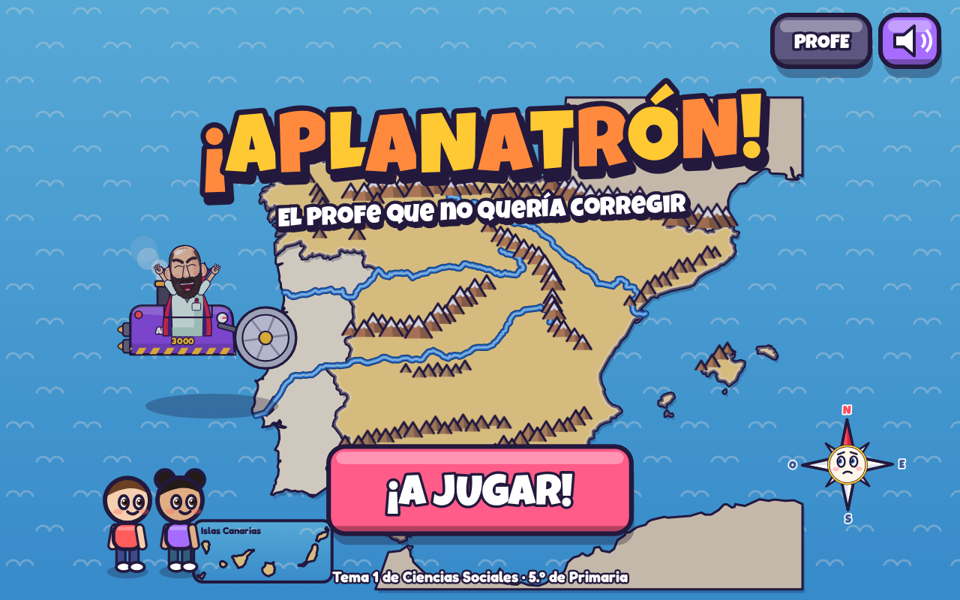
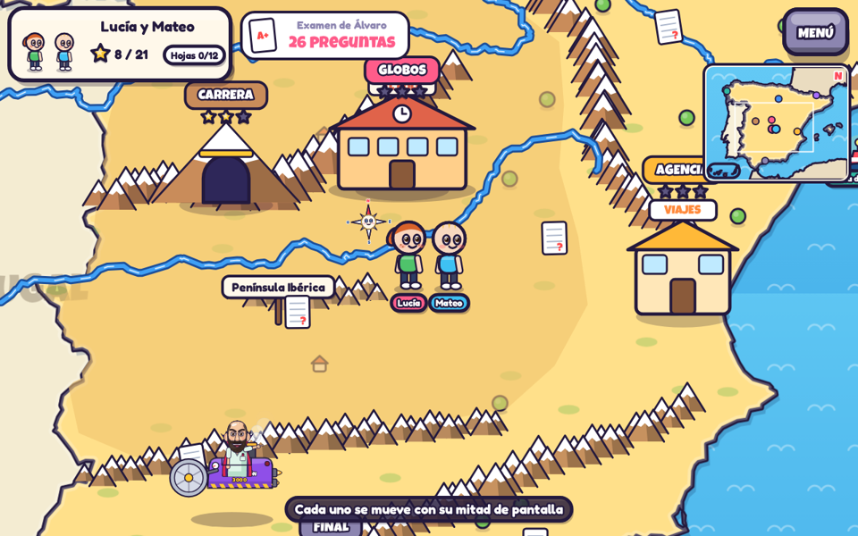
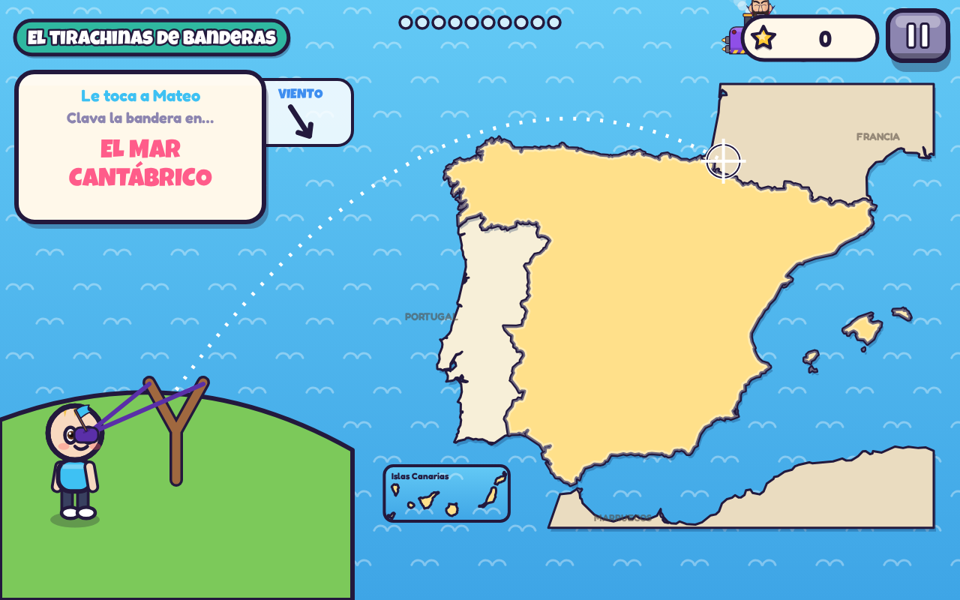
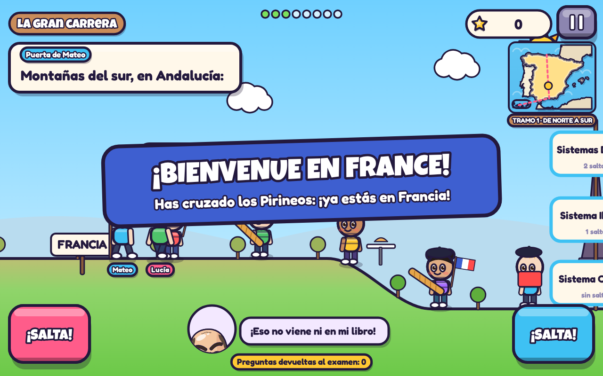
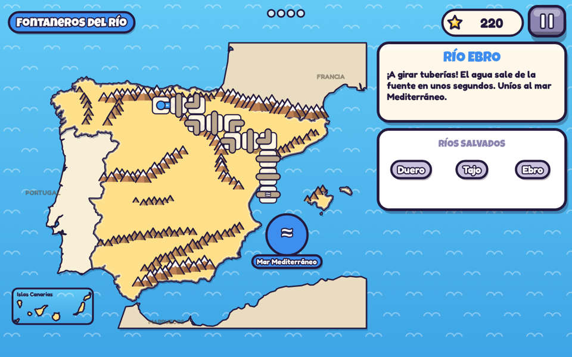
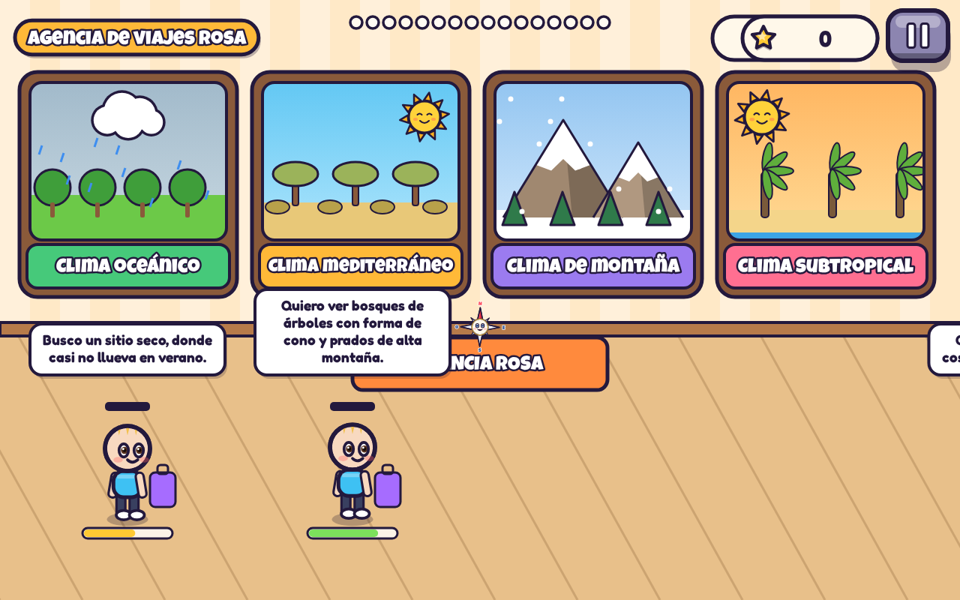
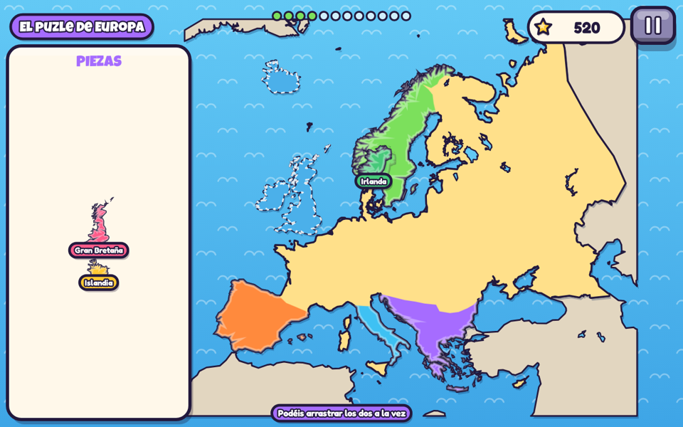
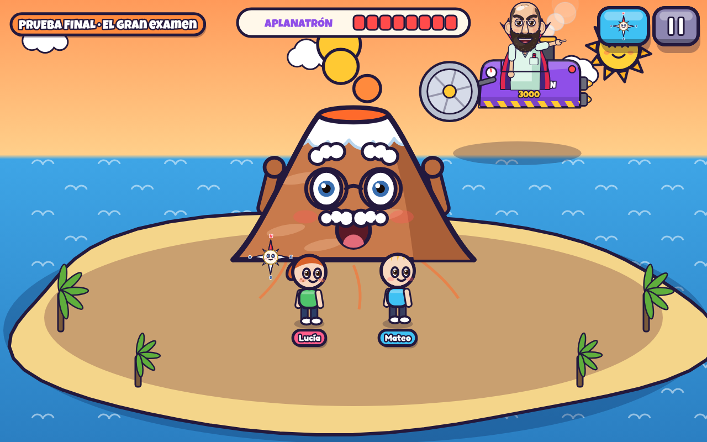

# ¡Aplanatrón! · El profe que no quería corregir

Juego del **tema 1 de Ciencias Sociales de 5.º de Primaria** («Como aquí, pero allí»): relieve, costas, ríos y climas de España y medio físico de Europa. Funciona en tablets y en ordenador, **con 1 jugador** (en casa) **o con 2** (en los grupos interactivos).

Domingo, 23:47. El profesor Álvaro lleva todo el fin de semana corrigiendo exámenes del tema 1: 47 preguntas por 50 alumnos. Y tiene una idea. Si España fuera **plana**, el examen tendría una sola pregunta: «¿Cómo es España?». Respuesta: «Plana». Así que saca el **Aplanatrón 3000** y aplana el mapa de la clase. Las montañas se aplastan, los ríos se secan y los nombres salen volando. El lunes, los alumnos acaban dentro del mapa. Allí les ayuda **Rosa, la rosa de los vientos**, y cada cosa que devuelven al mapa es una pregunta más que Álvaro tendrá que corregir.

## Dónde jugar

**Con cuenta y puntuaciones online:** https://aplanatron.cuaderno-alvar-x100.workers.dev/

**Partidas locales en GitHub Pages:** https://aronfenix.github.io/aplanatron/

La copia de **GitHub Pages** permite jugar y guardar partidas en ese navegador. Para entrar con una cuenta de alumno y recuperar las puntuaciones en otro dispositivo hay que abrir la **dirección de Cloudflare**: el botón «CUENTA ONLINE» necesita el servidor y la base de datos de esa dirección. Las partidas locales y el código de tres palabras continúan funcionando en ambas copias.

En cada tablet, abre la dirección en Chrome y usa **⋮ → Añadir a pantalla de inicio**. El juego se usa en horizontal.

## Puntuaciones online (Cloudflare)

- El profesor entra como `profe` y crea una cuenta con contraseña para cada alumno. Las contraseñas se guardan derivadas mediante PBKDF2; no aparecen en GitHub.
- Cada alumno entra con su propia cuenta. Puede jugar solo o elegir un compañero de la clase. La pareja tiene una partida compartida y cualquiera de sus dos miembros puede continuarla.
- Se guardan las estrellas, el mejor resultado de cada prueba, las hojas recogidas, los fallos para repasar y el avance del mapa. El panel del profesor muestra las puntuaciones de las partidas individuales y las parejas.
- Si se corta la conexión, el juego conserva los cambios pendientes en ese dispositivo y vuelve a enviarlos al recuperar la conexión. Los récords y las estrellas no bajan al sincronizar dos dispositivos.
- Las puntuaciones son resultados del juego calculados en el navegador, no calificaciones verificadas por el servidor.

Para desplegar una actualización: `python codigo/tools/build.py`, `npm install`, `npx wrangler d1 migrations apply aplanatron --remote` y `npx wrangler deploy`. La contraseña inicial del profesor se configura como secreto `TEACHER_PASSWORD` en Cloudflare. Nunca se incluye en el repositorio.

## Cómo se juega

- Al empezar se elige **1 o 2 jugadores**. Cada jugador elige su muñeco y escribe su nombre. Hay tres niveles: **Tranqui**, **Normal** y **Turbo**.
- **El mapa** es una España pequeñita por la que se camina: tocando el sitio al que quieres ir o arrastrando el dedo como un joystick (en ordenador, con WASD o con las flechas). Si entras en el mar, el muñeco se convierte en barco. En pareja, cada uno maneja su muñeco con su mitad de la pantalla.
- Por el mapa están **las pruebas**. Se entra en el orden que se quiera. Cada prueba superada arregla su trozo del mapa (vuelven las montañas, los ríos, los nombres…) y suma preguntas al contador del **examen de Álvaro**.
- También hay **12 hojas del examen de Álvaro** perdidas por el mapa. Cada una enseña una pregunta con su respuesta.
- Al superar las cinco pruebas principales se abre el **puerto del sur**: la prueba final.

## Las pruebas

Cada prueba es un juego distinto y empieza con una tarjeta que explica cómo se juega.

| Prueba | Qué se aprende | Cómo se juega |
|---|---|---|
| **El tirachinas de banderas** (faro de Finisterre) | Península Ibérica, mar Cantábrico, océano Atlántico, mar Mediterráneo, Baleares, Canarias, cabo de Finisterre, golfo de Cádiz, estrecho de Gibraltar, delta del Ebro | Se tensa el tirachinas, se apunta y se clava una bandera en el sitio pedido. Las zonas son las reales: todo el Cantábrico cuenta como Cantábrico. En Normal y Turbo hay viento. |
| **La gran carrera** (túnel del Sistema Central) | Cordillera Cantábrica, Meseta Central, Sistema Central, Sistemas Béticos, Teide, Sistema Ibérico, depresión del Ebro y Pirineos (frontera natural con Francia) | Un corredor de perfil que cruza España de norte a sur y después del centro a Francia. Antes de cada forma del relieve hay tres puertas (sin saltar, un salto, dos saltos). Al pasar por la buena, la montaña se levanta. Un minimapa enseña el recorrido. Empieza con una cuenta atrás desde el mar, frena al acercarse a cada puerta y la pregunta va en una sola línea arriba para no tapar las puertas. Al cruzar los Pirineos se llega a un pueblo francés (baguettes, banderas, boinas y «¡Bonjour!»). |
| **Fontaneros del río** (depósito de agua) | Duero, Tajo y Ebro: dónde nacen y dónde desembocan. Ríos del norte: cortos, rápidos y caudalosos | Se toca la fuente de las montañas donde nace el río y el mar donde desemboca. Después aparecen tuberías sobre el **cauce real** y hay que girarlas antes de que llegue el agua. |
| **Agencia de viajes Rosa** (Valencia) | Climas oceánico, mediterráneo, de montaña y subtropical: temperaturas, lluvias, vegetación en general y dónde están | Llegan turistas pidiendo cosas («quiero calor todo el año») y hay que arrastrarlos a la puerta de su clima antes de que se les acabe la paciencia. Alguno es sospechoso… |
| **El puzle de Europa** (frontera de los Pirineos) | Penínsulas Ibérica, Itálica, Balcánica y Escandinava; Gran Bretaña, Irlanda e Islandia; Gran Llanura Europea; Alpes; Urales; Rin y Danubio | Las penínsulas y las islas están recortadas del mapa de verdad y hay que encajarlas. Después se pegan las pegatinas de montañas, llanura y ríos. |
| **Globos del diccionario** (el cole, extra) | Vocabulario del relieve y de la costa | Se revienta el globo con la palabra correcta. |
| **La prueba final** (puerto de Málaga) | Todo el tema | En el mapa grande, cinco tareas mezcladas (llevar un cartel a su sitio, levantar una cordillera, abrir la fuente de un río, encender el faro de Finisterre, arreglar una estación del tiempo) y la batalla contra el Aplanatrón en Canarias, con las bolas de lava del Teide: las bolas caen en la isla y hay que acercarse y pulsar **¡COGER!** (ya no se cogen solas) y luego **¡LANZAR!**. La arena ocupa toda la pantalla. |

## El final

Al ganar la prueba final se ve una animación (unos 40 s, se puede saltar): el Aplanatrón cae al Atlántico, el profe vuelve a clase empapado y con una estrella de mar, corrige los 50 exámenes y sonríe un poquito porque habéis demostrado que os lo sabéis… y esa noche, con el libro del Tema 2 delante, empieza a pensar su próxima maldad (el VOTATRÓN 5000). Se puede volver a ver desde el menú del mapa (**VER EL FINAL**).

## Vídeos de teoría: el cine de Rosa

Hay tres vídeos cortos con la teoría del tema:

| Vídeo | Se ve antes de |
|---|---|
| **Las palabras del mapa** | El tirachinas de banderas (o los globos, si se empieza por ahí) |
| **El tiempo loco** | Agencia de viajes Rosa |
| **Europa en globo** | El puzle de Europa |

- La primera vez que se entra en esas pruebas se ve su vídeo. Se puede saltar con **¡A JUGAR!**.
- Todos los vídeos se pueden volver a ver desde **MENÚ → VÍDEOS** en el mapa.
- Los archivos están en `public/videos/`. `python codigo/tools/build.py` los copia a `docs/videos/` para GitHub Pages (git guarda una sola copia de cada vídeo, así que no ocupa el doble).

## Fallos, pistas y esquema

- Cuando se falla, Rosa explica la respuesta y el juego espera a que se pulse «¡VALE!». Si la tablet tiene voz en español, hay un botón para oírlo.
- En el tirachinas y en los globos, lo que más se falla vuelve a salir más a menudo; en el tirachinas, además, cada sitio fallado se repite al final.
- Al acabar cada prueba sale **«Para el cuaderno»**, con los fallos escritos en limpio para copiarlos, y se desbloquea un trozo del **esquema del tema**.
- El progreso local se guarda en el navegador. Para seguir en otro dispositivo sin cuenta online está el **código de tres palabras** del menú del mapa, que se escribe en «Tengo contraseña». Ese código representa las estrellas; no es una credencial privada y no incluye las puntuaciones.

## Panel del profe

Botón **PROFE** en la pantalla de título. Código: **CORREGIR**.

- Progreso de cada jugador o pareja guardado en esa tablet: estrellas por prueba, contraseña y lo que más le cuesta.
- Cambiar el nivel o borrar un jugador o pareja.
- Abrir la prueba final aunque no estén todas hechas.
- Modo ligero de efectos, por si alguna tablet va lenta (el juego lo activa solo si hace falta).
- Esquema completo del tema.

## Detalles técnicos

- El juego usa un archivo HTML con arte y fuentes integrados; la interfaz online añade `accounts.css` y `accounts.js`. Las partidas locales funcionan sin conexión una vez cargado.
- La música se genera en el propio navegador y cambia según la prueba.
- Mapas con datos reales de Natural Earth (dominio público).
- Nota: el progreso de versiones anteriores no pasa a esta.
